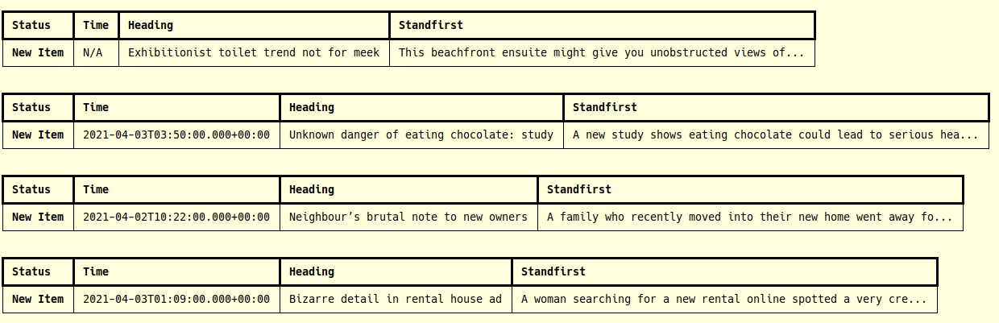
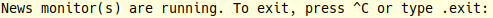
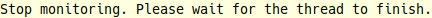
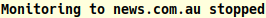
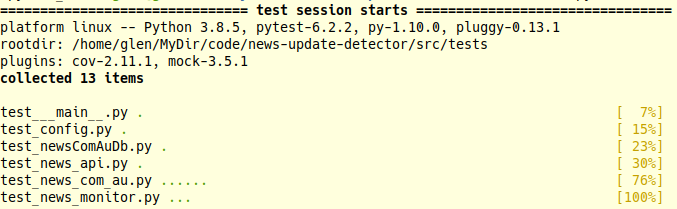
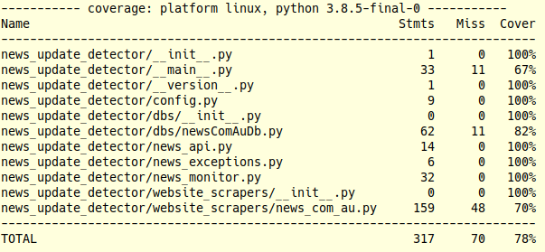

# news-update-detector

This repo provides a demo program for [isentia](https://www.isentia.com/) interview process. Task description can be found [here](https://bitbucket.org/isentia/coding-challenge-news-update-backend/src/master/).

|Task description|Status|
|----------|-------|
|Use python3| ✓ |
|Regularly scan| ✓ |
|Write details to command line| ✓ |
|Basic use of a relational database| ✓ |
|Instructions on how to run the program| ✓ |
|Unit tests| ✓ |
|Documentation| ✓ |
|Use of git| ✓ |

## Run in local environment

```bash
python3 -m venv news_update_detector_venv
source news_update_detector_venv/bin/activate
pip install -r requirements.txt
python src/news-update-detector.py
```
Or enter,
```
$ ./run.sh
```


## Run using docker-ce

1. Build docker image: `sudo docker build -t detector_image .`
2. Run docker image: `sudo docker run detector_image`


## How the program works

This program collects news from the front page of [news.com.au](https://www.news.com.au/) periodically, showing details when a new item was added or an existing item was updated.

When the program detects a new item was added to the front page, it will write a message to the command line. Some items do not have an update time, and they are usually an article not hosted on [news.com.au](https://www.news.com.au/) and/or not news, e.g., advertisement on [realestate](https://www.realestate.com.au/). New item records will be written to the database table.



When the program reads an item with an existing heading stored in the databse, it will compare the update times of the 2 records and try to show differences via `difflib` if necessary. Some updates do not seem to have differences in the command line, that's because `difflib` only try to compare the text collected by `_get_news_content`.

> I want to put a screenshot here to show what do updates look like, but it seems [news.com.au](https://www.news.com.au/) doesn't have updates during the holiday period.

When the program starts it will inform the user how to quit, i.e. `Ctrl-C` or type `.exit` (Copied from nodejs prompt)



When type `Ctrl-C` or `.exit` the program will set the stop flag and exit, but the thread which scans the website will quit when finishing current round of scanning.



When the thread also finishes it will write a message to the command line.




## Unit tests

Run unit test cases,

```
$ pip install pytest-cov
$ pytest --cov=news_update_detector tests/
```

**Test Cases**



**Coverage**

